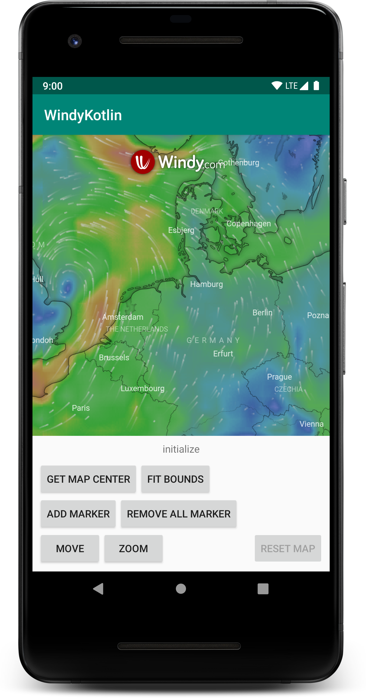

# WindyKotlin


[](https://github.com/thepeaklab/WindyKotlin/blob/master/LICENSE)
[](https://twitter.com/thepeaklab)

`WindyKotlin` is a wrapper for [windy.com](https://www.windy.com) written in Kotlin for the Android platform.



## Installation

  Add `jitpack`to your repositories in Project `build.gradle` :
  ```
  allprojects {
      repositories {
          ...
          maven { url "https://jitpack.io" }
      }
      ...
  }
  ```

  - Add dependency :
  ```
  implementation 'com.github.thepeaklab:WindyKotlin:1.0.0:'
  ```

## Usage

Add `WindyMapView` to your layout. This can be done by adding it directly to your layout xml file or in code.

```xml
<windykotlin.view.WindyMapView
    android:id="@+id/windyMapView"
    android:layout_width="match_parent"
    android:layout_height="match_parent"
    app:apiKey="<YOUR_API_KEY>"
    app:lat="<LATITUDE_VALUE>"
    app:lng="<LATITUDE_VALUE>"
    app:zoom="<ZOOM_LEVEL>" />
```

It is also possible to define just the basic `WindyMapView` in xml and init that one in code...

```xml
<windykotlin.view.WindyMapView
    android:id="@+id/windyMapView"
    android:layout_width="match_parent"
    android:layout_height="match_parent" />
```

```kotlin
override fun onCreate(savedInstanceState: Bundle?) {
	...
    val windyMapView = findViewById<WindyMapView>(R.id.windyMapView)
    windyMapView.setOptions(WindyInitOptions("<YOUR_API_KEY>"))
	...
}
```

... or to define the complete View in code

```xml
<FrameLayout
    android:id="@+id/container"
    android:layout_width="match_parent"
    android:layout_height="match_parent" />
```

```kotlin
override fun onCreate(savedInstanceState: Bundle?) {
	...
    val container = findViewById<FrameLayout>(R.id.container)
    val windyMapView = WindyMapView(
        context = this,
        options = WindyInitOptions(
            key = "<YOUR_API_KEY>"
        )
    )
    container.addView(windyMapView)
	...
}
```

### Region

##### Move center to coordinate

```kotlin
val coordinate = Coordinate(lat = 53.528740, lng = 8.452565)
windyMapView.panTo(coordinate)
```

##### Change zoom level

```kotlin
val zoomLevel = 10
windyMapView.setZoom(zoomLevel, WindyZoomPanOptions(true))
```

##### Fit Bounds

Fit the map, to that a list of coordinates are visible.

```kotlin
val coordinates = listOf(
    Coordinate(lat = 53.528740, lng = 8.452565),
    Coordinate(lat = 53.505438, lng = 8.476923),
    Coordinate(lat = 53.488712, lng = 8.410969),
    Coordinate(lat = 53.456613, lng = 8.477863),
    Coordinate(lat = 53.449079, lng = 8.425022),
    Coordinate(lat = 53.415919, lng = 8.468630),
    Coordinate(lat = 53.406520, lng = 8.394845)
)

windyMapView.fitBounds(coordinates)
```

##### Get current map center coordinate

```kotlin
windyMapView.getMapCenter { coordinate ->
    coordinate?.let {
        Log.d("WindyMapView", "center is: $it")
    } ?: let {
        Log.d("WindyMapView", "no coordinate")
    }
}
```

#### Marker


##### Add Marker...

There are three possible ways to define a image as map marker icon based on their type. At the `WindyIcon`a icon can be defined at `url`, `drawable` or `asset`.

##### ... by url

A default image url can be used to define a icon
```kotlin
WindyIcon(
	...
	icon = Icon(url = "http://www.myiconfinder.com/uploads/iconsets/256-256-a5485b563efc4511e0cd8bd04ad0fe9e.png"),
	...
)	
```

##### ... by *drawable*
A drawable can be used to define a icon. Windy can't access the drawable directly so a temporarly File is created (containing the drawable content) which is referenced by a content provider uri.
```kotlin
WindyIcon(
	...
	icon = Icon(drawable = R.drawable.my_marker_icon)
	...
)
```

##### ... by *asset*
A asset, located at the asset folder can be used to define a icon. Like at described for a drawable, Windy can't access the asset directly so a temporarly File is created (containing the asset content) which is referenced by a content provider uri.
```kotlin
WindyIcon(
	...
	icon = Icon(asset = "my_icon.gif")
	...
)
```

Complete code snippet
```kotlin

val uuid = UUID.randomUUID()

val coordinate = Coordinate(lat = 53.528740, lng = 8.452565)

val marker = Marker(
    uuid = uuid,
    coordinate = coordinate,
    icon = WindyIcon(
    	icon = Icon(drawable = R.drawable.my_marker_icon),
        iconSize = Point(30, 40),
        iconAnchor = Point(0, 0),
        popupAnchor = Point(0, 0)
    )
)

windyMapView.addMarker(marker)
```

##### Remove Marker

A marker can be removed by it's UUID.

```kotlin
windyMapView.removeMarker(markerUUID)
```

#### Handle Windy Events

Windy throw a bunch of events. If thesee should be handled, a Eventhandler needs to be defined.
The tap on a marker also throws a event of type `markerclick` with the corresponding marker uuid at the options.
```kotlin
override fun onCreate(savedInstanceState: Bundle?) {
    ...
    windyMapView.setEventHandler(this)
    ...
}

override fun onEvent(event: WindyEventContent) {

    when (event.name) {
        WindyEventContent.EventName.initialize -> onInitialize(event.options)
        WindyEventContent.EventName.zoomstart -> onZoomStart(event.options)
        WindyEventContent.EventName.zoomend -> onZoomed(event.options)
        WindyEventContent.EventName.movestart -> onMoveStart(event.options)
        WindyEventContent.EventName.moveend -> onMoveEnd(event.options)
        WindyEventContent.EventName.zoom -> onZoom(event.options)
        WindyEventContent.EventName.move -> onMove(event.options)
        WindyEventContent.EventName.markerclick -> onMarkerClick(event.options)
    }
}
```


## Need Help?

Please [submit an issue](https://github.com/thepeaklab/WindyKotlin/issues) on GitHub.

## License

This project is licensed under the terms of the MIT license. See the [LICENSE](LICENSE) file.